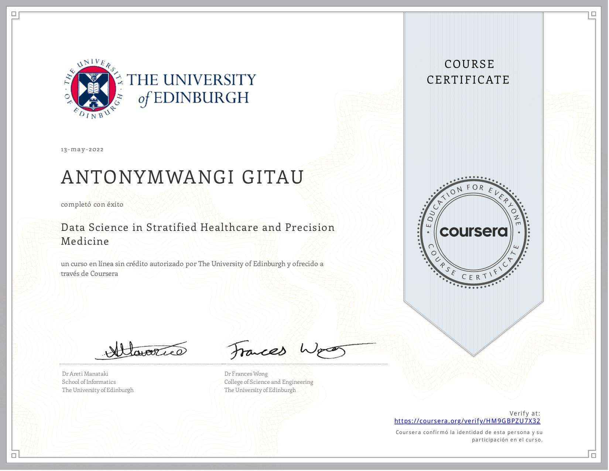

# `Data Science in Stratified Healthcare and Precision Medicine.`

These are the series of projects and assignments I did while taking the course (*[Data Science in Stratified Healthcare and Stratified Healthcare](https://www.coursera.org/learn/datascimed)*)

# Week one : Introduction to programming in python

Topics covered included:
+ Basic data structures
Working with tuples, lists, dictionaries.
+ working with pandas library:
 series and dataframes.
+ Reading csv with pandas, working with the data and visualizing it. 

*Case studies*
1. Prof Andrew - [Bioinformatics](https://d3c33hcgiwev3.cloudfront.net/WSbpukSyEei2HRICdYDggg.processed/full/360p/index.mp4?Expires=1662940800&Signature=by5t~~wjwre9oQfL7nSNSA3rqE0ySGg3V9foqQqiiMkThiohRcUl2ugDk66NzR9Jn8thJJH87~i-SH6XL9FcvN0Vvd1rra05HIdcsgB-KGJnztDyu4mBZSsg8F1rh6a7YvBqx2TRNwRC0GyGR3ZJJ1iZPMA1xot1nio3rTL9vLk_&Key-Pair-Id=APKAJLTNE6QMUY6HBC5A)

2. Prof Keel -  [Healthcare delivery program](https://d3c33hcgiwev3.cloudfront.net/OTx8BESzEeigbgqkS_SCag.processed/full/360p/index.mp4?Expires=1662940800&Signature=N8lfvDJmJmGZiPtUug2zgcrlRjiFz7QGmk6IPpLD5so5DrLFUnmdxWjDByJJ-v9-6O-r6OrJ4g4EhKdd5nhjD5-HHL7bK0Ig3crve6ubAqjTE2EX8tr1HyrXULGsAcNx3WCetP~DSAPvdYo4nOXa1shGKT40IVbXxaD-f7Q8kkY_&Key-Pair-Id=APKAJLTNE6QMUY6HBC5A)

# Week two : Sequence Processing and Medical Image Analysis

This involved working on DICOM format data storing MRI images.

Using; 
+ pydicom python package for working with DICOM files.
+ SimpleITK an image processing library. Useful in segmentation development and imgae registration program.
+ visualizing  MRI images using matplotlib
+ manipulating the data: doing segmentation, smoothing, hole-filling, and working with white and gray matter.

*case studies*
1. Prof Tim - [sequencing](https://d3c33hcgiwev3.cloudfront.net/kizQrES1EeiVcg6irwbSYA.processed/full/360p/index.mp4?Expires=1662940800&Signature=A0InD-abPNbiJi6FkFo1hQiE0-lu0MGGokJYbPxz-3Z7UBccdnDes4m400eNjqJOB32tPkWHsiqI3Xv8N5Y621rfuMK0QpkOxqZokSZ~sa~WEFqZR7SpUhlxC9edxixXl3vuPvhBxAnvO4wZHb0K7XVpHuFfkCCK1IRuPygK74g_&Key-Pair-Id=APKAJLTNE6QMUY6HBC5A)

2. Prof David - [more sequencing](https://d3c33hcgiwev3.cloudfront.net/fLJaCES2EeigbgqkS_SCag.processed/full/360p/index.mp4?Expires=1662940800&Signature=XgLinDEr1-wMS3kJv5LdGtzKY9MOu1T2gVs7GyhyywkCqRYrdOQizBopTDkZA8l9rMucXVY31lp1lE5WentYBWMk0-nhsHRf4cvlVz7REC5eMIuf66kqALtsA~LjzzdEMrdl-N1tZLWI41mVOMUzDZUurOTBPMjsuEoabsG-UcQ_&Key-Pair-Id=APKAJLTNE6QMUY6HBC5A)

# Week three : Probabilistic, Network Modelling and an introduced to Machine Learning in Biomedicine
This involved a discussion on network representation, examples of biological networks.
Key statistical methods for analysing medical data and basic machine learning techniques to medical data.

# Week four : Natural Language Techniques

This involved a discussion and application natural language processing techniques on clinical data.
Interpreting basic process models in healthcare and a different technique for analysing processes.

Angus McCann from IBM [Case study](https://d3c33hcgiwev3.cloudfront.net/VQnR9kS7EeiVcg6irwbSYA.processed/full/720p/index.mp4?Expires=1663372800&Signature=UWiZ-DbtcWzrJTHY-maF~avpXmyqQgHEJTiPg-Sprhcy1HmEGGVjStBPjr6f7a6QFReVNjY76M9w7sXiM-tg1-RNWz3b9D752fp5gwo5tiCw8CcNS3DYWataZbRaRFNAzY9PHCC9cODjVXZ25uXL1Z7N4v5Tx0XRVUx0uC2EX6o_&Key-Pair-Id=APKAJLTNE6QMUY6HBC5A).

Rodrigo Barnes from Aridhia [case study](https://d3c33hcgiwev3.cloudfront.net/BtLqB0TCEeigbgqkS_SCag.processed/full/720p/index.mp4?Expires=1663372800&Signature=d-hjhzS5UBVMY~6pC2B5JRIAEgnfPexIiMc76G0zUsSWzp9Q4837NvFOKtBpQC5vZT1Oa3loo7sLG1NqXku~U4TuqhyV9XIOGZdJG4mBOTGbzuYtZGKwjaji~ejmHh-YvUqyVLOvM4XecPP6pJBm2XjAz6wo8FQWhRfk4PQpmHg_&Key-Pair-Id=APKAJLTNE6QMUY6HBC5A).

# Week five : Graph Data model and explore societal, legal and ethical implications of precision medicine and stratified healthcare

This week involved a discussion on graph data modelling, key ontologies in medicine and general data protection regulation. 
This was followed up be a legal, ethical, and societal implication of precision medicine and stratified healthcare.

Dr. Steve Pavis [case study](https://d3c33hcgiwev3.cloudfront.net/dpzkp0b3EeiV-Ap8VLXT-A.processed/full/360p/index.mp4?Expires=1663372800&Signature=XCMHdONdj~V1HHpCFYXII81wtuC9QNPyh3Y3-u47bbdOKInfcAdFX4TwHk7DPv5XTqSZZcC93PTeaDfwCVNCPOcWrs114gHZfkOqfudkzBFQ0MXabQL-3aAUfbJQOVC4h-tdpMk08nzt1MeKk268~gykTMQOTCvEr1yIhGWhUXg_&Key-Pair-Id=APKAJLTNE6QMUY6HBC5A).

Professor Mark Parsons [case study](https://d3c33hcgiwev3.cloudfront.net/dpzkp0b3EeiV-Ap8VLXT-A.processed/full/360p/index.mp4?Expires=1663372800&Signature=XCMHdONdj~V1HHpCFYXII81wtuC9QNPyh3Y3-u47bbdOKInfcAdFX4TwHk7DPv5XTqSZZcC93PTeaDfwCVNCPOcWrs114gHZfkOqfudkzBFQ0MXabQL-3aAUfbJQOVC4h-tdpMk08nzt1MeKk268~gykTMQOTCvEr1yIhGWhUXg_&Key-Pair-Id=APKAJLTNE6QMUY6HBC5A).